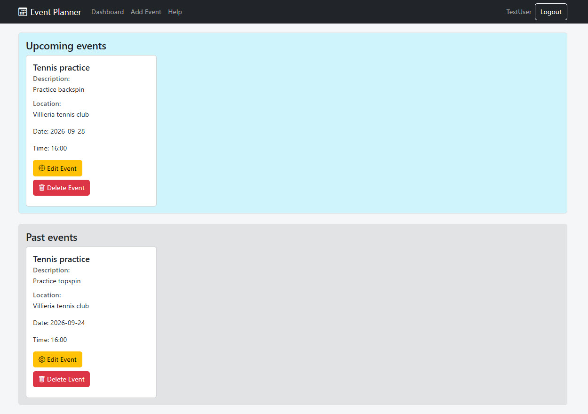
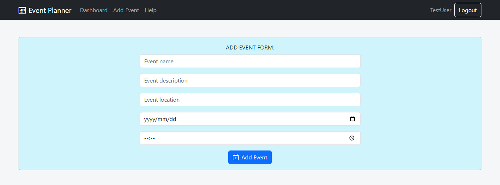
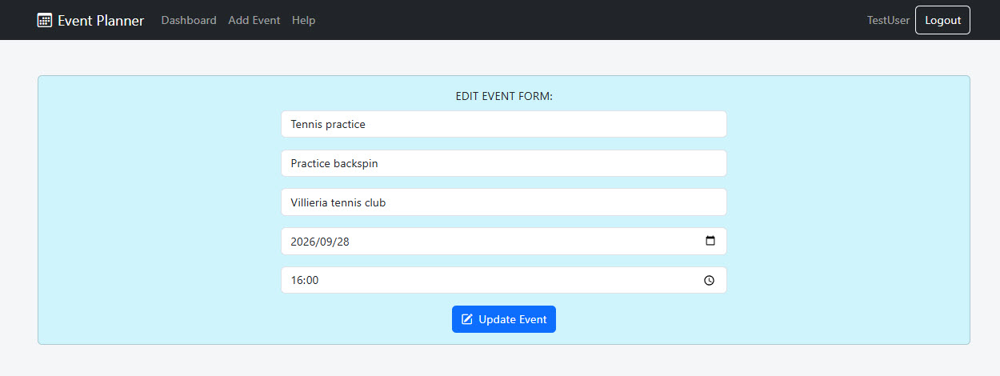
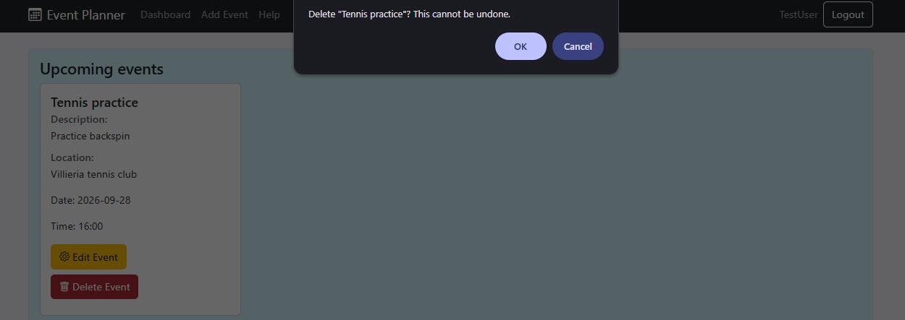
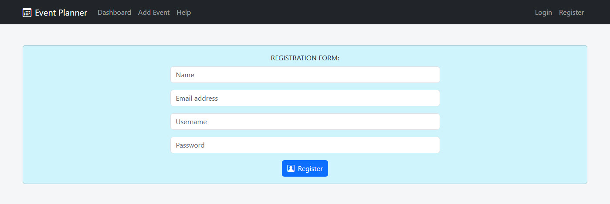
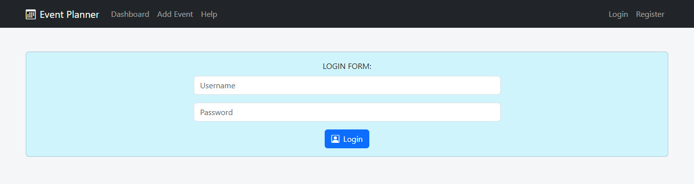

# Event Planner

A personal event planner built as a HyperionDev capstone project. Register an account,
log in, and manage your own events — add, edit, and delete them from a dashboard split
into upcoming and past events.

## Features

- **Accounts** — register with a name, email, username, and password (validated with
  Formik: no empty fields, a valid email format, and a password with 8+ characters
  including an uppercase letter, a lowercase letter, a number, and a special character).
  Duplicate usernames/emails are rejected.
- **Login / logout** — log in with your username and password. Protected pages
  (Dashboard, Add Event, editing an event) redirect to Login if you're not signed in.
- **Dashboard** — your events, split into Upcoming and Past sections, sorted by date,
  rendered with `array.map()`.
- **Event management** — add, edit, or delete events (name, description,location, date,
  time, ). Changes update the dashboard immediately.
- **Fixed navigation header** — always visible, with links to Dashboard, Add Event, and
  Help, plus Login/Register or your username and a Logout button depending on whether
  you're signed in.
- **Help page** — a collapsible guide covering navigation, registration, and managing
  events.
- **Responsive design** — built with React Bootstrap; the navigation collapses into a
  menu on narrower screens, and the event grid adapts from one column up to four.

Data (accounts and events) is stored in the browser's `localStorage`, so it persists
between visits without needing a backend. Note that, as with any app storing data this
way, passwords are kept in plain text — fine for a portfolio demo, but must never be
done this way in a real application.

## Screenshots












## Tech stack

- [React](https://react.dev/) (via [Vite](https://vitejs.dev/))
- [React Router](https://reactrouter.com/) for navigation and protected routes
- [Formik](https://formik.org/) for form state and validation
- [React Bootstrap](https://react-bootstrap.github.io/) for UI components
- [Bootstrap Icons](https://icons.getbootstrap.com/) for icons

## Getting started

Install dependencies:

```bash
npm install
```

Run the development server:

```bash
npm run dev
```

Then open the local URL shown in the terminal (usually `http://localhost:5173`).

## Running tests

```bash
npm run test
```

Runs the unit tests (`storage.js`) and a snapshot test (`Help.jsx`) with Vitest.

## Project structure

```
src/
  assets/              — screenshots used in this README and the Help page
  context/
    AuthContext.jsx    — user accounts, login state, persisted to localStorage
    EventContext.jsx   — events for the current user, persisted to localStorage
  components/
    Layout.jsx          — fixed header + page content
    Header.jsx           — navigation bar
    ProtectedRoute.jsx   — redirects to Login if not signed in
    EventCard.jsx        — displays one event, with Edit/Delete actions
    EventForm.jsx         — shared form for adding and editing events
  pages/
    Register.jsx, Login.jsx
    Dashboard.jsx
    AddEvent.jsx, EditEvent.jsx
    Help.jsx, Help.test.jsx
  utils/
    storage.js, storage.test.js
```
